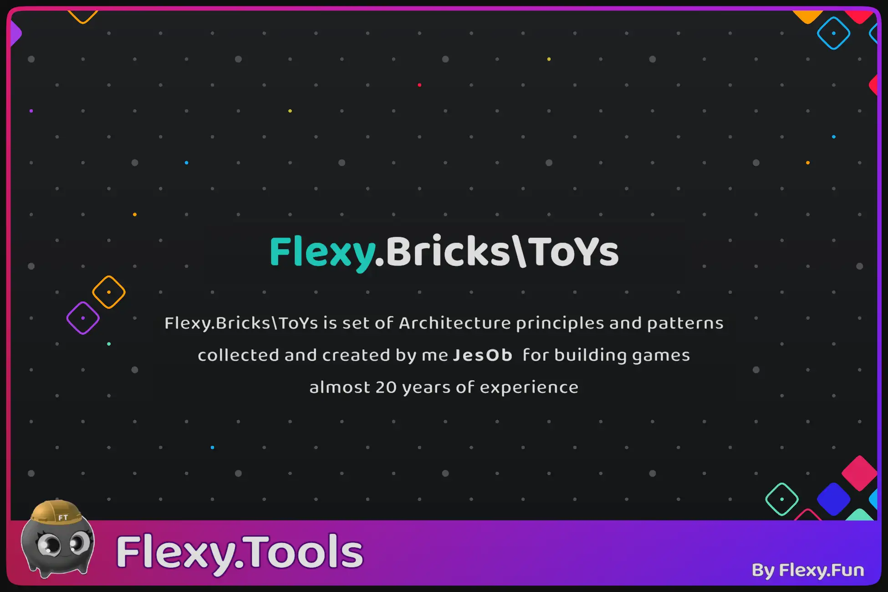

[Flexy.Tools](../../Readme.md) / [Flexy.Bricks\ToYs](../Readme.md) / [Project Structure](Readme.md) / !Game 

# !Game  

All game assets placed under !Game folder because of few factors:

3rd party assets often need to be placed in Aseets and can not be moved so as project grows Assets become more and more trashed  
To separate 3rd party assets from game I have moved it into folder !Game. '!' to make it clear that it is most important part and it is sorted up :)

Game project consist of many high level parts so structure of !Game folder resemble it as close as possible  
Names of inner folder are self explanatory but created in a way that you need to read it with path:

| Folder           | Description                                                                                                                  |
|------------------|------------------------------------------------------------------------------------------------------------------------------|
| !Game/!Code      | all game code see [Code Structure](CodeStructureAndFlexyProjectTemplate.md)                                                  |
| !Game/Audio      | all global audio assets, mixers, libraries and Service_Audio prefab                                                          |
| !Game/Flow       | all assets that define GameFlow (Game States and transitions) based on Flexy.GameFlow package                                |
| !Game/Flow/Boot  | all prefabs that define Game Boot UIs (Splash, EULA, Bundles Load, Consent, AgeSelect, etc)                                  |
| !Game/Flow/Menu  | all prefabs that define Game Menu UIs (MainMenu, Settings, Leadeboards, Shop, Arsenal, etc)                                  |
| !Game/Flow/Play  | all prefabs that define Game Play States and theor viewa (Play state (Hud), Pause State, Results, Cutscene, NPC Dialog, etc) | 
| !Game/Maps       | all GameMaps. Scenes with game levels. May be divided by Biomes                                                              |
| !Game/Mobs       | all assets ToYs that define different Mobs in game (PlayerMob, Enemies, NPCs, Vehicles, etc.)                                |
| !Game/Modes      | all assets ToYs that define GameModes (single player often consist from one mode but multiplayer have planty of modes)       |
| !Game/Build      | all build and publish related assets, build pipelines, icons, etc.                                                           |
| !Game/Settings   | all GameSettings . URP setting, Input settings, Graphic Tiers Settings, etc.                                                 |
| !Game/UIKit      | all UIKit assets and ready to use UI Controls and Widget prefabs. Fonts, UI Sprite Atlases.                                  |
| !Game/Boot.scene | scene game start from. Here actually only Bootstrapper prefab and camera so Unity not complain in the beginning              |
| !Game/Asset.refs | asset pipeline that will collect all assets and put to build for onDemand loading using AssetRefs package                    |

## Prefabs and Sources

All folders with assets have Prefabs in it for use in game  
Sources from which Prefabs are created are placed in Src Subfolder in every folder with prefabs    
Somw projects too lightweight so they have no Src folders. **Idea** looks like this:
- !Game/Mobs
  - Enemies
    - Swordsmen.prefab
    - Archer.prefab
    - Mortar.prefab
    - Test_Enemies.scene - scene where all enemies placed. Test polygon for use in enemy development, tuning and testing
    - Src
      - Swordsmen folder  - with all textures, meshes, animations, and materials
      - Archer folder  - with all textures, meshes, animations, and materials
      - Mortar folder  - with all textures, meshes, animations, and materials

This way when you open an Enemies folder, you can see exactly what the game uses, but not sources of it  
Something like when you open Garage, you see cars but not wires, and other internals they build from 

## !Game/Flow      

This is the core part of the game. Here (or in Menu, Play sub dirs) is Bootstrap prefab that launches the game      
It must be placed in every scene you want to start from. Like Test scenes, GameMaps   
Also here is GameFlow prefab that defines Root of Game Flow.  
Bootstrapper will spawn it first  
Library - stores refs to all States possible of the game  

## !Game/Build

Here you can see pipelines to build Release and dev builds  
They consist of Tasks that do anything you want   
Here you can find only builtin ones that help to setup UniversalVersion and build player   

To build game select BuildPlayer SO and press run :)  

 

[Flexy.Tools](../../Readme.md) / [Flexy.Bricks\ToYs](../Readme.md) / [Project Structure](Readme.md) / !Game 