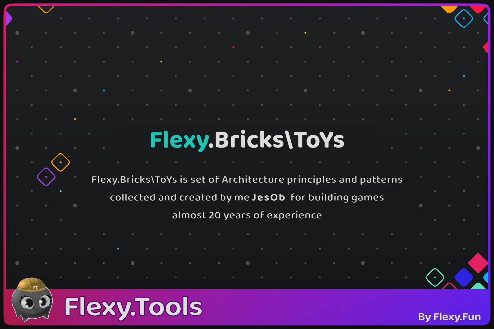

# Flexy.Bricks\ToYs
  
[Flexy.Fun](https://flexy.fun)
| [Unity Forum](https://discussions.unity.com/t/flexy-assetrefs-v5-0-0-released/1605799)
| [Asset Store](https://assetstore.unity.com/publishers/113112)

Flexy.Bricks\ToYs is set of Architecture principles and patterns collected and created by me **JesOb** for building games  

Over almost 20 years of experience I have learned a lot about game development,  
filter and slightly change meaning of tools that actually works for it  
With those you can create modular, testable and fault-tolerant bricks(modules), ToYs and compose games from them  

### Brick\ToY Building Principles
- **SPOT** - every system has a single responsible source of truth  
- **KISS** - write simple predictable and understandable code  
- **Pure & self-sufficient** -  independent, modular systems  
- **Plug & Play** - context-based dependency resolution instead of specific initialization logic  
- **State Driven** - the game is controlled entirely via States, which is served by GameContexts  
- **Data Driven** - game systems work as IO systems through data stream and async message bus  
- **Nature Oriented (Domain Based)** - game systems align closely with natural game design domains  
- **Testable** - Input-Output-driven system design enables robust testing  
- **Fault Tolerance** - decoupled dependencies prevent cascading failures  
- **Composition vs Inheritance** - compose flexible system design for extending functionality  
- **Concrete vs Abstract** - premature abstraction is discouraged  
- **MC-VmV** - Clear separation between game logic and presentation
- **Clear Architecture** - Layered architecture where all references look only to inner circles    

### Write simple code
Using heuristic
- That it “Fits In My Head”  
- That it easy to change  
- That it easy to reason about  
- By focusing on use rather than reuse  

### Testing
- Test use cases  
- Test integration (playable tests)  
- Tests is usage samples  
- Write Characterisation tests  

### Create with Patterns
- Services  
- Facade  
- State  
- Component & ECS  
- Msg Bus  
- Pipeline  
- Flyweight  
- EventAction  

### MC-VmV
**Model & Command (host):**   

|    |          |                                  |                                                                          |  
|:---|:---------|:---------------------------------|:-------------------------------------------------------------------------|
| M  | Model    | (Entities, Data Struct / Class)  | pure data with methods for changing it and serialisation                 |  
| C  | Command  | (Use Cases, System Tick Job)     | business logic that act on many models (composition) to provide service  |

**Presentation (client)**  

|    |            |                                   |                                                                                                    |
|:---|:-----------|:----------------------------------|:---------------------------------------------------------------------------------------------------|
| Vm | ViewModel  | (Presenters, Update View Monobeh) | logic coupled to view that prepare data for view interpolate it, update view, get input from view  |   
| V  | View       | (Frameworks, Render Components)   | view layer that do actual visualisation of model using data state transformed by ViewModel         |