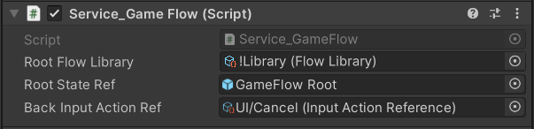

# Service GameFlow

[Flexy.Tools](../README.md) / [Flexy.GameFlow](README.md) / [Index](Index.md) / Service GameFlow

## Description

Entry point into GameFlow  
It initializes FlowLibrary and creates FlowGraph with RootState  
And allows to find State Openers in library  
Opener is small record struct that know open signature of state   

## Component

| Field                  | Description                                   |  
|------------------------|-----------------------------------------------|
| Root Flow Library      | Root library of states we collect states from |  
| Root State Ref         | Optional. Custom Prefab of root state         |
| Back Input Actiopn Ref | Optional. Back action reference               |

## Properties

| Property  | Description                     |  
|-----------|---------------------------------|
| Graph     | Access to initialized FlowGraph |  

## Methods

| Method                                                 | Description                                                              |  
|--------------------------------------------------------|--------------------------------------------------------------------------|
| Open< T > ( State src, Object? openParams = null )     | Open state by finding it by **Type T** and open with optional openParams |  
| GetOpener_ById ( State src, String croppedOrFullGuid ) | Get Opener by full or cropped(7 symbols) guid of prefab                  |
| GetOpener_ByStateType< T > ( State src )               | Get Opener by State Type                                                 |
| GetOpener_ByOpenerType< T > ( State src )              | Get Opener by Opener Type                                                |
| GetRefTypeName ( AssetRef<State> stateRef )            | Get TypeName of state by reference. Mostly for debug purposes            |

 

[Flexy.Tools](../README.md) / [Flexy.GameFlow](README.md) / [Index](Index.md) / Service GameFlow