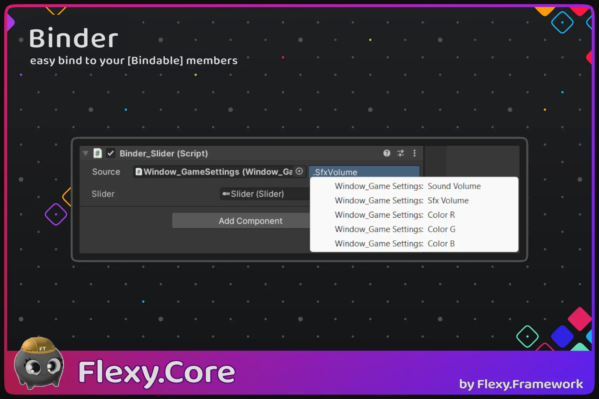

[Flexy.Tools](../../Readme.md) / [Framework](../Readme.md) / [Flexy.Core](Readme.md) / Binders

# Binders

Core of Flexy.Binding system  
This is one of basis parts of **Flexy.Bricks** **MC-VMV** pattern for binding View to ViewModel   
It is core feature because it can be used not only in UI but in coregame too
  
**Binder** - base class to derive binders from  
**BindableBehaviour** - optional base class to know who was bound and call rebind requests back to them   
**CallBinder** - base class to derive **call** binders from     
**Bindable and Callable** attributes - to mark members intended for binding

**Binder_GameObjectBoolean** - binder implementation sample  
**CallBinder_ButtonClick** - call binder implementation sample    

 

[Flexy.Tools](../../Readme.md) / [Framework](../Readme.md) / [Flexy.Core](Readme.md) / Binders