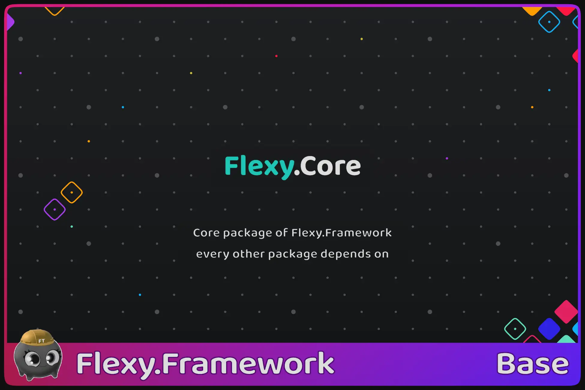

[Flexy.Tools](../../../Readme.md) / [Framework](../../Readme.md) / [Flexy.Core](../Readme.md) / [Scripting Api](Readme.md) / Bindable Behaviour

# Bindable Behaviour

## Description

Inherits from: MonoBehaviour

Optional base class to know who was bound and call rebind requests back to them

## Properties
| Property           | Description                                                                      |  
|--------------------|----------------------------------------------------------------------------------|
| ReadyForBind       | Returns true if binders can bind to component data otherwise false. Default true |                                        

## Methods

| Method                    | Description                                                                                     |  
|---------------------------|-------------------------------------------------------------------------------------------------|
| MakeBindReadyAndRebindAll | Mark component as Bind ready and rebind all currently awaiting binders                          |
| MakeBindUnready           | Mark component as bind unready to delay Bind operation on binders until component will be ready |
|                           |                                                                                                 |
| RebindAll                 | Rebind All binders                                                                              |
| RebindProperty            | Rebind binders that bound to specified property `names`                                         |

## Extensions

| Method              | Description                                            |  
|---------------------|--------------------------------------------------------|
| GetService < T >    | GetService of type T or throw exception                |  
| TryGetService < T > | GetService of type T and return Boolean success/fail   |

 

[Flexy.Tools](../../../Readme.md) / [Framework](../../Readme.md) / [Flexy.Core](../Readme.md) / [Scripting Api](Readme.md) / Bindable Behaviour

