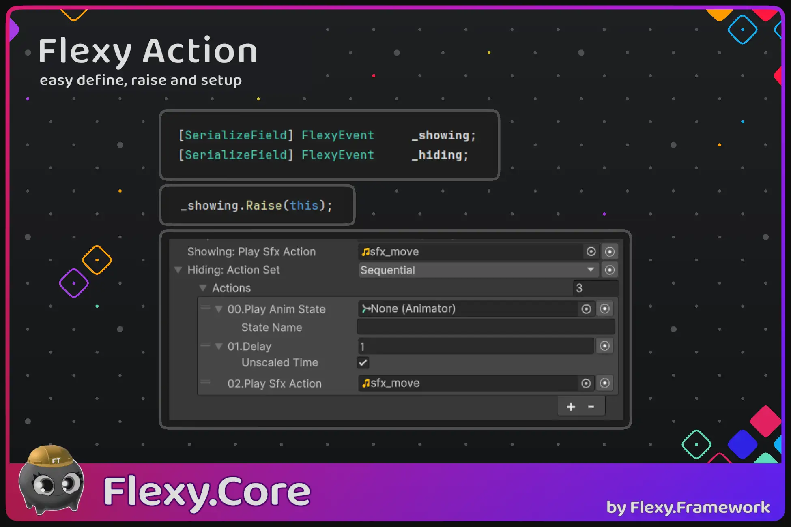

[Flexy.Tools](../../../Readme.md) / [Framework](../../Readme.md) / [Flexy.Core](../Readme.md) / [Scripting Api](Readme.md) / Flexy Action

# Flexy Action

## Description

FlexyAction Inherits from: object
FlexyEvent Inherits from: struct

**Flexy Actions** is universal and composable system to do action in response to event.

## FlexyEvent Events
| Event  | Description                 |  
|--------|-----------------------------|
| Raised | Register callback to event  |

## FlexyEvent Methods
| Method | Description                                                                               |  
|--------|-------------------------------------------------------------------------------------------|
| Raise  | Raise action of event with `srcObject` as context so action can know context of execution |                                        

## FlexyAction Methods

| Method            | Description                    |  
|-------------------|--------------------------------|
| Do `virtual`      | Do action logic Synchronously  |
| DoAsync `virtual` | Do action logic asynchronously |

Derive from FlexyActionSync or FlexyActionAsync to implement only one way

## FlexyAction Extensions

| Method         | Description                                                                               |  
|----------------|-------------------------------------------------------------------------------------------|
| Raise          | Raise action of event with `srcObject` as context so action can know context of execution |  
| GuardedDoAsync | Correct Do Async wrapper for use in overrides                                             |

 

[Flexy.Tools](../../../Readme.md) / [Framework](../../Readme.md) / [Flexy.Core](../Readme.md) / [Scripting Api](Readme.md) / Flexy Action

