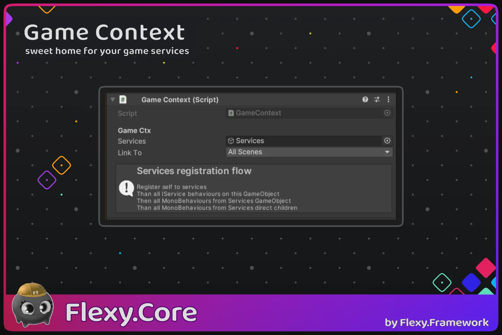

[Flexy.Tools](../../../Readme.md) / [Framework](../../Readme.md) / [Flexy.Core](../Readme.md) / [Scripting Api](Readme.md) / Game Context

# Game Context

## Description

Inherits from: MonoBehaviour

Flexy way to think about game dependencies and their composition. **Context based**  
You can think like DI Container but more clear and tied to scenes and GameObjects so you can get GameContext from every GO or scene

### Services registration flow  
Register self to services  
Than all IService behaviours on this GameObject  
Then all MonoBehaviours from Services GameObject  
Than all MonoBehaviours from Services direct children  

## Component
| Field    | Description                                        |  
|----------|----------------------------------------------------|
| Services | Optional GameObject with additional services       |
| Link To  | To what scenes to link on Awake (All, Local, None) |

## Properties
| Property            | Description                                                                        |  
|---------------------|------------------------------------------------------------------------------------|
| Global `static`     | GlobalContext                                                                      |                                        
| Parent              | Parent Context                                                                     |
| Ext                 | Optional. IGameContextExtension                                                    |
| IsAlive             | Cached Alive state of GameContext (for cheaper check)                              |
|                     |                                                                                    |
| InitStatus          | Initialisation status (InProgress, Sucess, Fail)                                   |
| InitializingService | Service currently being initialized (while async init in progress)                 |
| FailReason          | Service Fail Reason text (Exception and InnerException)                            |

## Methods

| Method                            | Description                                                                                                |  
|-----------------------------------|------------------------------------------------------------------------------------------------------------|
| GetCtx `static`                   | Get Local Context for GameObject Component or scene                                                        |
| LinkScene                         | Link `scene` to this GameContext. GetCtx from `scene` will return this GameContext                         |
|                                   |                                                                                                            |
| SetParent                         | Set parent for context. Useful to set before spawning or Activating GameObject to create desired hierarchy |
| GetService < T >                  | GetService of type T or throw exception                                                                    |
| TryGetService < T >               | GetService of type T and return Boolean success/fail                                                       |
| SetService                        | SetService into Context with `replace` existing or Log Exception                                           |
| GetDisplayServiceName `static`    | Get Nice display name of service                                                                           |
|                                   |                                                                                                            |
| WaitInitialization                | async wait for service initialisation and get Initialisation Status                                        |
|                                   |                                                                                                            |
| InitializeServices `virtual`      | Override to add custom sync initialisation logic in derived GameConext Classes                             |
| InitializeAsyncServices `virtual` | Override to add custom async initialisation logic in derived GameConext Classes                            |

## Extensions

| Method              | Description                                            |  
|---------------------|--------------------------------------------------------|
| GetService < T >    | GetService of type T or throw exception                |  
| TryGetService < T > | GetService of type T and return Boolean success/fail   |

 

[Flexy.Tools](../../../Readme.md) / [Framework](../../Readme.md) / [Flexy.Core](../Readme.md) / [Scripting Api](Readme.md) / Game Context

