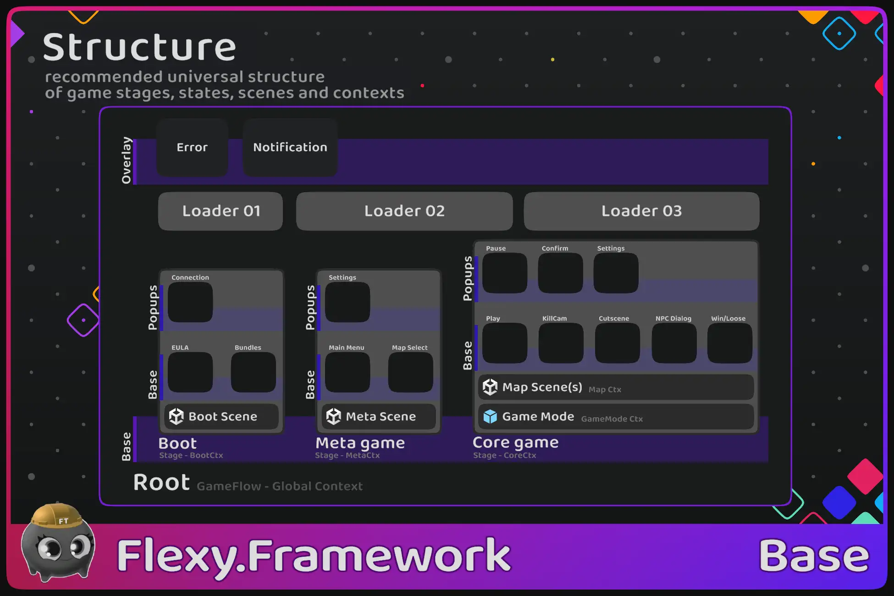



# How It Works & Use Cases

[Flexy.Tools](../../Readme.md) / [Framework](../Readme.md) / [Flexy.GameFlow](Readme.md) / How It Works & Use Cases

## Main Idea

Game is hierarchical set of states that transition to each other  
Common Hierarchy is Root -> GameStage -> State -> SubState
Some state place their substates on different layers like overlay layer or Popups layer     
Every state has some visual representation and logic like UIWindow or PlayState or CutsceneState  

Because of this GameFlow looks like a UI thing, but it is not   
It is more fundamental, but you will build UI on top of it  

When you play game in Coregame Stage you see **3D or 2D Game World** and something on top of it  
That something is HUD and it is main PlayState of a game   
When that something changes, it means the game switches to a new state (in gamer mind), regardless of how it works under the hood   

Any new state of Game will show new visual representation for gamer so he knows what happens, Cutscene started, Player was killed, Bossfight started, NPC dialog, entered Freecam mode  
They all affect not just the visuals, but also how the player interacts with the game, controls changed, camera changed, etc.  
So it is truly different state of a game   
State not only represent new State of a game but actually controls the game in current state and decide when it is ready to switch to another one  
Big states - GameStages also most of the time control scene loading/unloading Boot state loaded from BootScene (first scene of a game), Stage Meta loads MetaScene (Lobby Scene), StageCore loads and unloads playable game maps   

**Flexy.GameFlow** make those states and transition obvious in code too and easy to work with, develop and test

## Core Concepts

### Bootstrap
Main entry point of game.  
It runs first spawns Service_GameFlow (with global GameContext) and first GameStage to start from  
Typical setup is bootstrap open Boot GameStage. Boot then drive game loading process and Opens Meta GameStage

### Service_GameFlow
Root of GameFlow (Root state and Node) 
It keeps refs to FlowLibrary and BackAction and constructs FlowGraph in runtime

### Flow Library
Scriptable object that keeps track of all states the game has, scattered across different directories
Typical usage is RootLibrary, CommonLibrary and one library for each GameStage Boot, Meta and Core  
This is for simplicity of project organization

### Game Stage
Represents big states of a game like Boot, Meta, Core, etc.

Meant to be All In One solution for big Stages like BattleStage
enter battle with ```await Game.Flow.OpenBattle(map, mode)```,  
when battle ends just ```CloseAndDestroy()``` and everything that was part of battle (states, resources, scenes) unloaded and battle result returned
what to play next battle? just open new one! It is that simple as it must be :)  
  
GameStage always spawned as children of Graph Root and by default live as root GameObjects of DontDestroyOnLoad scene
Also every GameStage has its own GameContext
Regular States spawned on different Stage layers by default Base layer sometimes popups layer or any other layer you create        
By default there is one Active State on each layer but this is up to TransitionRoot to decide

### State
Main working horse  
Many states will represent UIWindows and some of them will be PlayStates
Typical states of game: MainMenu, Leaderboard, Settings, PlayState, PauseState, WindState  
States can have substates inside of them. e.g. Shop with Tabs  
You can nest as deep as you like, but most of the time 3 levels is enough
Once loaded states dont get destroyed, they are reused for every state open
Typically destroyed along with GameStage they belong, when GameStage itself CloseAndDestroy

To create new GameState you derive from state class and create prefab from it  
Then open state by calling Service_GameFlow.Open<MyStateClass>() or using Openers
 
### Opener
Is small record struct designed to provide statically typed signature of State open interface  
It defines all ways state can be opened (all Open method signatures)

### Transition Root
Responsible for managing transitions between states  

Logical transitions are driven by FlowGraph but Visual ones are driven by TransitionRoot  
TransitionRoot can do only one transition at a time so if you want to show more state transitions at once you need to spawn more TransitionRoot (this is useful in split screen games)  
Transition runs last in Update so code can create many different changes in FlowGraph in frame from different callbacks but,  
transition happens only once in final state from currently active State to new logical Tip     
FlowGraph spawn TransitionRoot on RootNode  

Transition root resolve transition operation for 2 states prev and next from their common parent and operation will do all logic of transition  
Default TransitionOperation is InstantTransition that just deactivate old state and active new one synchronously  
You can define any custom logic of state transitions like animations or overlays that cover screen while transition happening  

Typically GameStage will show Loader screen on opening and closing of itself but sometimes is it handy to have single LoaderScreen covering transition between two GameStages  
because GameStages are Fat, and they often unload old scenes and load new ones as part of transition   
e.g. transition from Meta to Core. Meta first unload Lobby scene and than Core will load requested BattleMap scene 

Transition Root can be locked. This allows to lock graph on some state so any **external** (not from current Tip Node) attempts to change state will open it before locked one in graph   
Current state is allowed to change itself to any other

In Networked FPS you open PauseState and lock it. You can freely navigate to setting and other states but
if game try to put you from PlayState to KilledState and back it will happens under pause menu so
user flow will not be interrupted. When user exits pauseState it will go back to PlayState or KilledState based on what is actually active here


### Transition Operation
It is a struct that carries transition data and has methods that help you write correct State Transition Logic    
In custom transition Function you need to close old state and open new one visually 

### Flow Graph
Graph of all opened nodes     
It spawns RootNode on construction and have methods to open, close nodes  
Graph will correctly spawn new node for state open, connect it to graph (set all 6 links) and call LogicalEvents on state like Open, Close, etc 
After any change graph will schedule transition on closest TransitionRoot (in parent hierarchy from change) to do actual transition

### Flow Node 
The Main thing in state machine graph is FlowNode  
Each node in graph have links to parent, firstchild, prev and next siblings and also history forward, back nodes  
So we have 6 axes of freedom here :)

Siblings are used to traverse all substates of a state.  
Get first\last state of GameStage etc.

Forward-back navigation is used to navigate through history of state switches  
Used to go back when BackAction performed
  
Each FlowNode has linked State. Most of the time Node to State relation is 1:1, but FlowGraph allows N:1 relation: Many FlowNodes has linked to same State e.g. Many Opened Nodes for Leaderboard State opened with different open params like different Filters   
The only Deterministic part of GameFlow is Logical Events of State (Open, Forward, Back, Close) that guaranteed to be called in relation (if open called then close will be called too, if forward called then back will be called too)
Visual Events (Show, ForwardHide, BackShow, Hide) are not guaranteed to be called in relation, State can be Showed then ForwardHidden and then closed with entire hierarchy without calling any other visual events      


## Use Cases

### Just Default It
Simple game starts from MainMenu (MetaStage) and then transition to PlayState (CoreStage)
Bigger ones have:
- Boot (Splash, EULA, AgeSelect, Consent, Load Profile, Load Resources, etc )
- Meta (Main menu, Settings, Shop, Leaderboard, Arsenal, etc)
- Core (BattleHud, KillKam, Pause, Freecam, Cutscene, Screeshot state, NPCDialog, GameOver, BossFight substate, etc) 

### Split Screen
Super easy implementation of split screen games  
Spawn Separate GameStage for every player with their own TransitionRoots and spawn player specific objects inside GameContext of corresponding GameStage  
This way you almost dont need to change you single player code because everyone trying to access GameStage or PlayerMob or PlayerCamera will access it from local context  
Line like Game.UI.Killcam.Open() will open Kilcam State for current player  

### TabWidows
Windows with tabs inside very handy to implement like State with substates   
So you can implement and test every tab in isolation and if it needs to show in other places  
Tab window itself responsible only for switching tabs nicely with animations  

<br/>

[Flexy.Tools](../../Readme.md) / [Framework](../Readme.md) / [Flexy.GameFlow](Readme.md) / How It Works & Use Cases