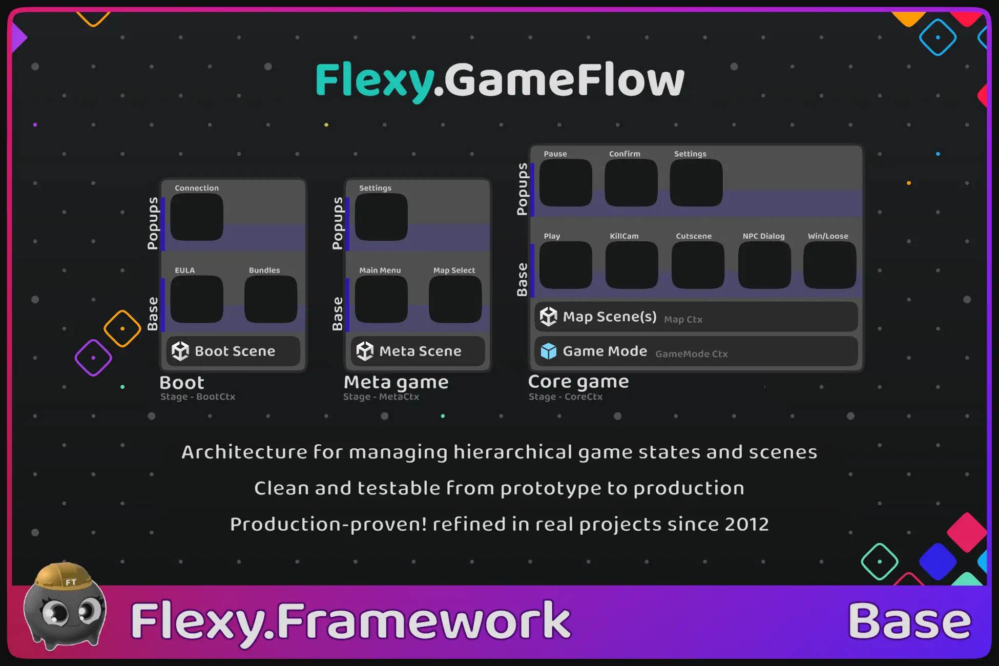



[Flexy.Tools](../../Readme.md) / [Framework](../Readme.md) / Flexy.GameFlow

# Flexy.GameFlow

Stop fighting menus, meta, gameplay, and scenes  
Hierarchical game state architecture for managing game states and scenes  
Clean and testable from prototype to production

[Github Lite](https://github.com/FlexyTools/Flexy.GameFlow)
<!-- | [Unity Forum](https://discussions.unity.com/t/a/1700923)
| [AssetStore](https://u3d.as/3LKx) -->  
[Start Guide](StartGuide.md)
| [How It Works & Use Cases](HowItWorks_UseCases.md)
| [Scripting Api](ScriptingApi/Readme.md)
| [Showcase(Template project)](../../GameTemplates/Readme.md)

Production-proven architecture, refined in real projects since 2012  
Design your game as explicit, testable states — from Boot and Meta to Core gameplay

## Overview

Flexy.GameFlow is a runtime architecture framework for Unity that replaces fragmented, ad-hoc game flow logic with explicit hierarchical states  
Instead of spreading flow logic across scenes, managers, FSMs, coroutines, and callbacks,  
your game becomes a structured State graph with clear ownership and lifecycle

- Big game stages (Boot → Menu/Meta → Play/Core
- UI navigation as states (Main Menu, Settings, Shop, Rewards, Arsenal)
- Gameplay states (Play, Pause, Win, Lose, Results, Cutscenes, Dialogs)
- Nested substates (Boss fights, result tabs, phase controllers)

- Any game state can be launched and tested in isolation
- Transitions are deterministic and awaitable
- Scenes, transitions, data flow, and runtime context are controlled through the state hierarchy
- Kee p every part of the game isolated, testable, and deterministic
- Feels like vanilla Unity — just much more powerful

Flexy.GameFlow has been used and refined in real production projects since 2014

## When game state architecture starts working against you

As projects grow, game flow logic becomes fragile and hard to reason about

- Adding a new menu or gameplay step introduces hidden coupling
- Flow logic becomes scattered across scenes, managers, and MonoBehaviours
- Async transitions turn into complex coroutine or callback chains
- Dependencies spread across unrelated systems, even when using DI
- Testing a single screen or gameplay phase requires running the entire game

Flexy.GameFlow addresses these problems by design

- One hierarchical state model for boot, menus, and gameplay
- Any state can be launched and tested directly
- Enter Play Mode from any scene with the correct state hierarchy on frame 0
- Scene loading and unloading driven by states
- Awaitable states with explicit input and output
- Deterministic transitions with guaranteed execution order
- Clean lifecycle ownership and automatic cleanup
- Scales naturally from prototype to production

## Key Benefits

- One unified system for game flow, scenes, and UI
- Explicit hierarchical state architecture
- Scene-independent navigation
- Deterministic async transitions
- Launch any state directly for testing
- Scoped service lifecycle per GameStage
- Safe from prototype to long-term production
- Removes the need for custom flow managers

## Key Features

- Hierarchical GameStages (Boot, Menu, Gameplay)
- FlowGraph & FlowNodes for logical navigation
- State-driven scene loading (Single & Additive)
- Back/Forward navigation with history
- Awaitable states with explicit results
- GameContext scoped per GameStage
- Play Mode entry from any scene
- TestScenes and TestCases for isolation
- CrossSceneRef system
- TransitionHost for safe visual transitions

## Pro Features

- Support for custom state layers (e.g. popup layer)
- Substates
- State locking
- Customizable transition logic for unique and rich state transitions
- SpawnTarget for injectiong state into any point
- Logical Open/Close and Forward/Back lifecycle hooks
- Precise await points for logical and visual state changes
- Asynchronous preload of state views
- Reboot game in full or from first stage

## Is This for You?

Flexy.GameFlow is a good fit if you:

- Build games with multiple menus and gameplay phases
- Struggle with fragmented or ad-hoc game flow logic
- Want deterministic async transitions
- Need fast iteration and isolated testing
- Work solo or in a team
- Plan long-term production

Flexy.GameFlow is not a good fit if you:

- Build very small single-scene games
- Prefer fully hardcoded scene logic
- Expect a visual no-code flow editor

Flexy.GameFlow is an architectural foundation and is intended to be adopted early

## Why Not FSMs or Scene Managers?

- Classic FSMs do not scale to full game hierarchies with async transitions
- Scene managers couple logic to scenes and make testing difficult

Flexy.GameFlow treats game states as first-class, with hierarchy, isolation, and deterministic transitions  
It uses standard Unity concepts with minimal additional abstractions  
It provides a higher-level layer that defines how game states relate, transition, and execute safely

## How to create new state

- Create State MonoBehaviour describing behavior
- Create prefab representing that state
- State is automatically added to the FlowGraph
- Open states through ServiceGameFlow
- States load scenes, manage transitions, and return results

Game flow becomes navigation between states rather than hardwired scene switching

## Showcase Projects
Learn through real, buildable template projects

- [FlexyTT.Barley-Break](https://github.com/FlexyTools/FlexyTT.BarleyBreak)
- [Flexy.TTMinimal GameFlow Showcase](https://github.com/FlexyTools/FlexyTT.GameFlow-MinimalShowcase)

These demonstrate full game flow, scene control, UI states, and testing workflows

[Start Guide](StartGuide.md) 
| [How It Works & Use Cases](HowItWorks_UseCases.md) 
| [Scripting Api](ScriptingApi/Readme.md) 
| [Showcase(Template project)](../../GameTemplates/Readme.md)

## Technical details

Compatibility

- Unity 2022.3 → Unity 6.3
- Modern C# (C# 10)
- Domain Reload safe
- Depends on Flexy.Core & Flexy.AssetRefs
- SceneManager used under the hood via SceneRefs
- Render pipeline agnostic
- Platform agnostic
- Networking friendly

Code Basics

- Single State base class for all state types (gameplay, UI, substates)
- Virtual Show/Hide and BackShow/ForwardHide methods
- Deterministic bootstrap initializes the correct state hierarchy from any scene
- Explicit state cleanup via Stage.CloseAndDestroy
- Explicit input and output data passed between states
- Awaitable states and transitions with strongly defined results
- Cross-scene references without hard scene dependencies
- Bootstrap prefab initializes the Service_GameFlow runtime
- Explicit GameStage abstraction for major phases (Boot, Menu, Play)
- FlowLibrary is centralized registry of states
- Graph-based state model using FlowGraph and FlowNode
- Runtime tracking of active and current state nodes

 

[Flexy.Tools](../../Readme.md) / [Framework](../Readme.md) / Flexy.GameFlow