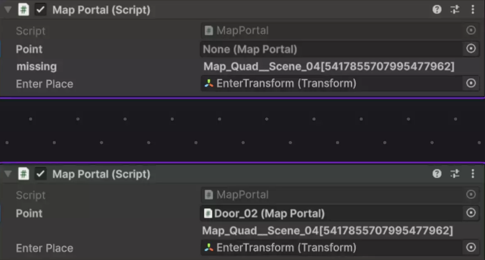

# Cross Scene Refs

[Flexy.Tools](../../../Readme.md) / [Framework](../../Readme.md) / [Flexy.GameFlow](../Readme.md) / [Scripting Api](Readme.md) / Cross Scene Refs

## Description

Allows to make ref to object in other scene like link this scene [exit Portal] to [enter Portal] on other scene

Set of classes that make ScrossSceneRef work

## CrossSceneRef : MonoBehaviour

Auto generate and Store UniversalIdentifier Uid for this object  
It is unique is scene  

## Properties

| Property       | Description                        |  
|----------------|------------------------------------|
| Uid            | Auto generated unique id of object |

 

## CrossSceneRefs 

Global store of live Cross Scene Refs  

## Methods

| Methods    | Description                                     |  
|------------|-------------------------------------------------|
| Get < T >  | Get T Component from referenced object or throw |
| Find < T > | Find T Component from referenced object or null |

 

## CrossSceneRef< T >

Serializable Struct to use as filed on your MonboBehaviours to reference objects in other scenes 

## Properties

| Property | Description                                     |  
|----------|-------------------------------------------------|
| Uis      | Get T Component from referenced object or throw |
| Scene    | SceneRef where ref Target lies                  |
| IsNone   | return true if ref is empty                     |
| None     | None Ref to compare                             |

## Methods

| Methods | Description                                     |  
|---------|-------------------------------------------------|
| Get     | Get T Component from referenced object or throw |
| Find    | Find T Component from referenced object or null |

 

[Flexy.Tools](../../../Readme.md) / [Framework](../../Readme.md) / [Flexy.GameFlow](../Readme.md) / [Scripting Api](Readme.md) / Cross Scene Refs
