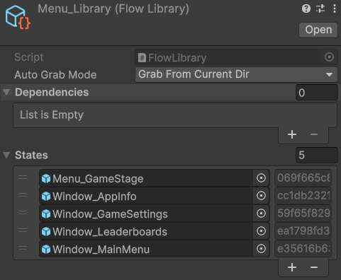

# Flow Library

[Flexy.Tools](../../../README.md) / [Framework](../../Readme.md) / [Flexy.GameFlow](../Readme.md) / [Scripting Api](Readme.md) / FlowLibrary

## Description

Scriptable Object that holds references to all states of the game  
Makes them available in runtime and easily be collected for builds 

## Component

| Field          | Description                                                   |  
|----------------|---------------------------------------------------------------|
| Auto Grab Mode | How to auto grab states? curr dir, curr and nested, manual    |  
| Dependencies   | Link to other libs so runtime collect states from all of them |
| States         | States of a game with cropped Guid to easily copy it          |

 

[Flexy.Tools](../../../README.md) / [Framework](../../Readme.md) / [Flexy.GameFlow](../Readme.md) / [Scripting Api](Readme.md) / FlowLibrary