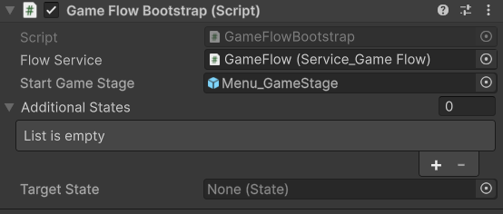

# Game Flow Bootstrap

[Flexy.Tools](../../../README.md) / [Framework](../../Readme.md) / [Flexy.GameFlow](../Readme.md) / [Scripting Api](Readme.md) / GameFlowBootstrap

## Description

Entry point script/prefab that bootstraps GameFlow

It spawns Service_Gameflow, start GameStage, additioanl states, and target state
Target State is used to fill TestCase DropDawn

All MonoBehaviours on bootstrap prefab will be added into the global context (Handy for boot customization on test scenes) 

## Component

| Field                 | Description                                                         |  
|-----------------------|---------------------------------------------------------------------|
| **Flow Service**      | Flow Service Prefab to spawn first on game launch                   |  
| **Start Game Stage**  | AssetRef to GameStage to spawn first                                |
| **Additional Stages** | Optional. Additional States to spawn into latest spawned Stage      |
| **Target State**      | Optional. Last state to spawn and source of TestCase Dropdown cases |

[Flexy.Tools](../../../README.md) / [Framework](../../Readme.md) / [Flexy.GameFlow](../Readme.md) / [Scripting Api](Readme.md) / GameFlowBootstrap