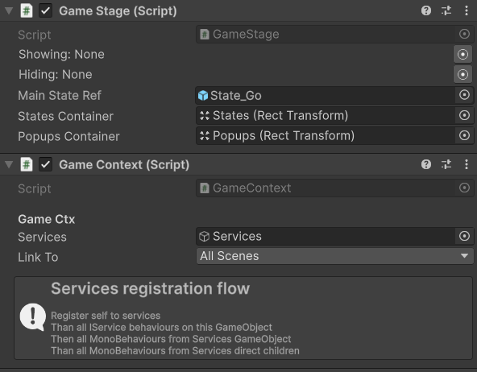

# ISubStates 

[Flexy.Tools](../../../Readme.md) / [Framework](../../Readme.md) / [Flexy.GameFlow](../Readme.md) / [Scripting Api](Readme.md) / ISubStates

## Description (Pro)

Interface for states that can hold substates.

## Properties

| Property        | Description                                                |  
|-----------------|------------------------------------------------------------|
| TransitionStore | Implementation Keeps StateTransition reference             |
| SubStatesCache  | Implementation Keeps SubStatesCache as dictionary          |
|                 |                                                            |
| Transition      | Readonly. Return StateTransition with current Node applied |

see [State](State.md) for inherited ones

## Methods

| Method                                         | Description                                                              |  
|------------------------------------------------|--------------------------------------------------------------------------|
| GetSupportedLayers                             | Implementor Must return array of substate layers supported by this State |  
| InstantiateSubState                            | Implementor must instantiate provided prefab on provided layer           |
| DestroySubState                                | Implementor must destroy provided state instance                         |
|                                                |                                                                          |
| InstantiateState                               | Can be uased in custom implementation of State preload                   |

## Extensions

| Method             | Description                                                                 |  
|--------------------|-----------------------------------------------------------------------------|
| Preload            | Preload state syncronously                                                  |  
| PreloadAsync       | Preload state asyncronously                                                 |
| PreloadLibrary     | Preload all states from library asyncronously with frameDelay between loads |
| ClearStatesCache   | Destroy all State that currently not active (not used)                      |

[Flexy.Tools](../../../Readme.md) / [Framework](../../Readme.md) / [Flexy.GameFlow](../Readme.md) / [Scripting Api](Readme.md) / ISubStates