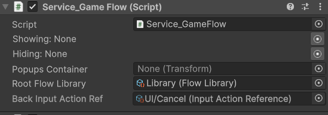

# Service GameFlow

[Flexy.Tools](../../../README.md) / [Framework](../../Readme.md) / [Flexy.GameFlow](../Readme.md) / [Scripting Api](Readme.md) / Service GameFlow

## Description

Inherits from: GameStage

Entry point into GameFlow and Root node of FlowGraph  
It initializes FlowLibrary and creates FlowGraph inserting self as RootNode
Allows to find State Openers in library  

## Component

| Field                  | Description                                   |  
|------------------------|-----------------------------------------------|
| Root Flow Library      | Root library of states we collect states from |  
| Back Input Actiopn Ref | Optional. Back action reference               |

## Methods

| Method                                                 | Description                                                                                              |  
|--------------------------------------------------------|----------------------------------------------------------------------------------------------------------|
| Open< T > ( State src, Object? openParams = null )     | Open state by finding it by **Type T** and open with optional openParams                                 |
|                                                        |                                                                                                          |  
| GetOpener_ById ( State src, String croppedOrFullGuid ) | Get Opener by full or cropped(7 symbols) guid of prefab                                                  |
| GetOpener_ByStateType< T > ( State src )               | Get Opener by State Type                                                                                 |
| GetOpener_ByOpenerType< T > ( State src )              | Get Opener by Opener Type                                                                                |
| GetRefTypeName ( AssetRef<State> stateRef )            | Get TypeName of state by reference. Mostly for debug purposes                                            |
|                                                        |                                                                                                          |
| RestartHard                                            | Closes all nodes up to the root, destroys all states and spawns first GameStage again. All synchronously |
|                                                        |                                                                                                          |
| virtual Update                                         | Calls TryGoBack when BackAction is triggered                                                             |
see [GameStage](GameStage.md) for inherited ones

 

[Flexy.Tools](../../../README.md) / [Framework](../../Readme.md) / [Flexy.GameFlow](../Readme.md) / [Scripting Api](Readme.md) / Service GameFlow