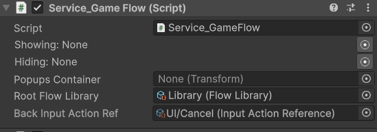

# Service GameFlow

[Flexy.Tools](../../../Readme.md) / [Framework](../../Readme.md) / [Flexy.GameFlow](../Readme.md) / [Scripting Api](Readme.md) / Service GameFlow

## Description

Inherits from: GameStage

Entry point into GameFlow and Root node of FlowGraph  
It initializes FlowLibrary and creates FlowGraph inserting self as RootNode
Allows to find State Openers in library  

## Component

| Field                  | Description                                                                       |  
|------------------------|-----------------------------------------------------------------------------------|
| Popups Container       | Global overlay layer popups place. Intended for Notifications, Error Popups, etc. | 
| Root Flow Library      | Root library of states we collect states from                                     |  
| Back Input Actiopn Ref | Optional. Back action reference                                                   |

## Methods

| Method                                                         | Description                                                                                        |  
|----------------------------------------------------------------|----------------------------------------------------------------------------------------------------|
| Open< T > ( State src, Object? openParams = null )             | Open state by finding it by **Type T** and open with optional openParams                           |
|                                                                |                                                                                                    |  
| GetOpener_ByStateType< T > ( State src, String? guid = null )  | Get Opener by State Type with optional by full or cropped(7 symbols) guid of prefab                |
| GetOpener_ByOpenerType< T > ( State src, String? guid = null ) | Get Opener by Opener Type with optional by full or cropped(7 symbols) guid of prefab               |
| GetRefType ( AssetRef<State> stateRef )                        | Get Type of state by by State Type with optional by full or cropped(7 symbols) guid of prefab      |
| GetStateRef_ByStateType ( Type type, String? guid = null )     | Get state reference by                                                                             |
|                                                                |                                                                                                    |
| Reboot                                                         | Closes all nodes up to the root, destroys all states and spawns first or specified GameStage again |
|                                                                |                                                                                                    |
| virtual Update                                                 | Calls TryGoBack when BackAction is triggered                                                       |
see [GameStage](GameStage.md) for inherited ones

 

[Flexy.Tools](../../../Readme.md) / [Framework](../../Readme.md) / [Flexy.GameFlow](../Readme.md) / [Scripting Api](Readme.md) / Service GameFlow