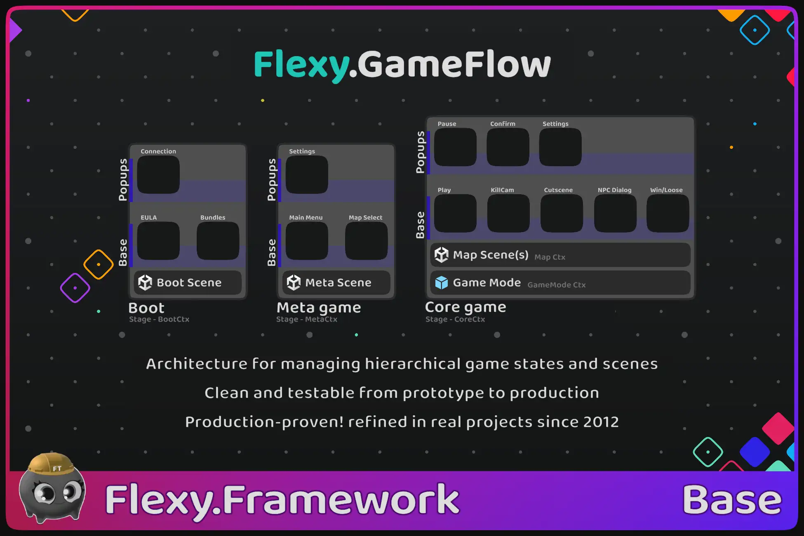
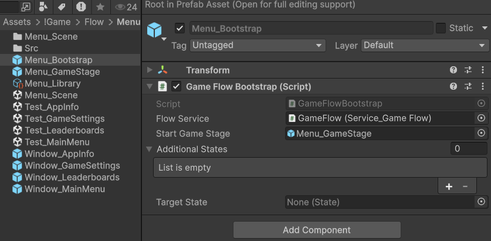
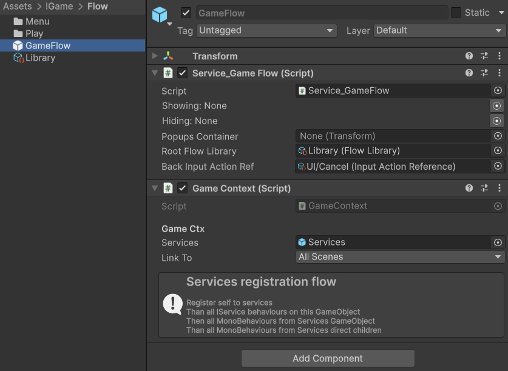
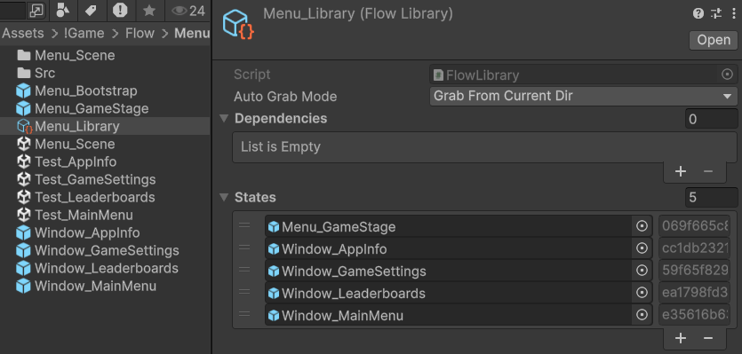
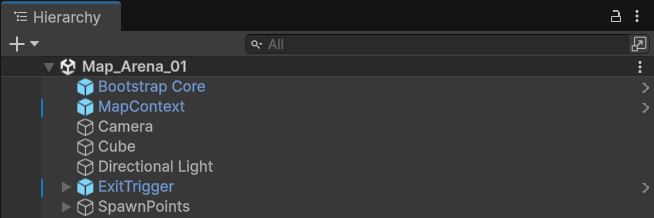
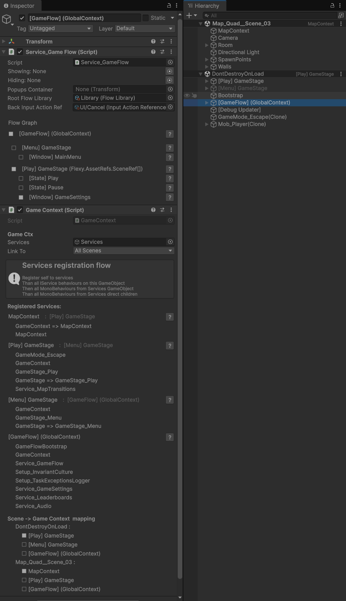



[Flexy.Tools](../../Readme.md) / [Framework](../Readme.md) / [Flexy.GameFlow](Readme.md) / Start Guide


# Start Guide

### Simple Start
Import Flexy.GameFlow package to your project  
Import **Packages/Flexy.GameFlow/FlowSampleURP.unitypackage** to your project  
Unity can ask to import TexMeshProEssential package. Install it.

Open Assets/FlowSample/Boot.unity and press Play  
You can see example of GameFlow in action with comments on every state and in Code

Here is very breaf explanation of work with GameFlow, but better look at Barley-Breaks  
Ask questions on Flexy.GameFlow Unity Discussions Thread


### Advanced Level

Clone template repo [**Barley-Breaks**](https://github.com/FlexyTools/Flexy-TT.BarleyBreak) or [**GameFlow MinimalShowcase**](https://github.com/FlexyTools/FlexyTT.GameFlow-MinimalShowcase)   
They are most complete example of GameFlow usage  
Learn how they structured and works  
Ask questions on Flexy.GameFlow Unity Discussions Thread 


## Structure
- Entry point - Bootstrapper prefab that will bootstrap Service_GameFlow  


- FlowLibrary holds references to all possible states of a game through AssetRefs and set link to library in Service_GameFlow
- Per GameStage folders, one for Metagame and one for Coregame encapsulate stage logic and states 
- Here you will find Stage Prefabs and states prefabs like MainMenu, Settings, ChooseMap, State_Play, State_Pause, etc.
- Also here Test_Scenes for every state to launch right from it with enabled test cases (available test cases to the right of play button)  

- In Code you will fine UIWIndowEx and StateEx derived from State  
  Those are ViewModels from MC-VMV pattern   	
   ```csharp
   public class Window_MainMenu : UIWindowEx
   {
       [Callable]	void	OpenPlayFields		( )		
       {
           this.GetService<Service_GameFlow>().Open<Window_PlayFields>(this); // Possible
       }
       [Callable]	void	OpenSettings		( )		
       {
           Game.UI.Settings.Open(); // But this is way better
       }
   }
   ```
- In every scene you see bootstrap prefab. This is what allows you to enter play mode from any scene  

- In Playmode you will see Hierarchical structure of GameFlow and your GameContexts with parent connections and their services  


[Flexy.Tools](../../Readme.md) / [Framework](../Readme.md) / [Flexy.GameFlow](Readme.md) / Start Guide