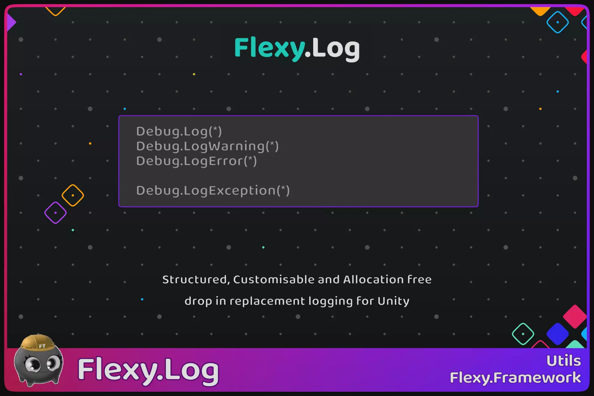



[Flexy.Tools](../../Readme.md) / [Framework](../Readme.md) / Flexy.Log

# Flexy.Log

**Structured, Customizable and Allocation free   
drop in replacement logging for Unity**  

Exted logs in your projects  
Easy replace logs in entire project with one line of code  
And make them Reach, Filterable and Allocation free on string interpolation
  

[AssetStore](https://u3d.as/3R6j) | [Scripting Api](ScriptingApi/Readme.md)

## Key Benefits

- Almost free on disabled logs
- Very low perf impact on enabled log filtering
- Enable/Disable logs in files on demand without rebuild/redeploy
- Customizable log formatting

## How It Works

- Reroute all calls to `Debug.Log` with `Flexy.Log.Debug` and handle logging in Allocation Free way

## How To use

- Enable C#10 support in project settings (add `-langversion:10` to additional compiler arguments)
- add line `global using Debug = Flexy.Log.Debug;` in one cs file in project to reroute calls  

## Additional

UnityEngine.LogFormat always allocates!  
To prohibit this, you can remove log format methods by adding define FLEXY_LOG__DISABLE_LOG_FORMAT to project settings  
Then fix errors in all places where you use Debug.LogFormat

## Technical Details

- Uses modern C# features (C# 10)
- Tested with Unity 2022.3 through Unity 6.3

 

### Have Fun :)

 

[Flexy.Tools](../../Readme.md) / [Framework](../Readme.md) / Flexy.Log
