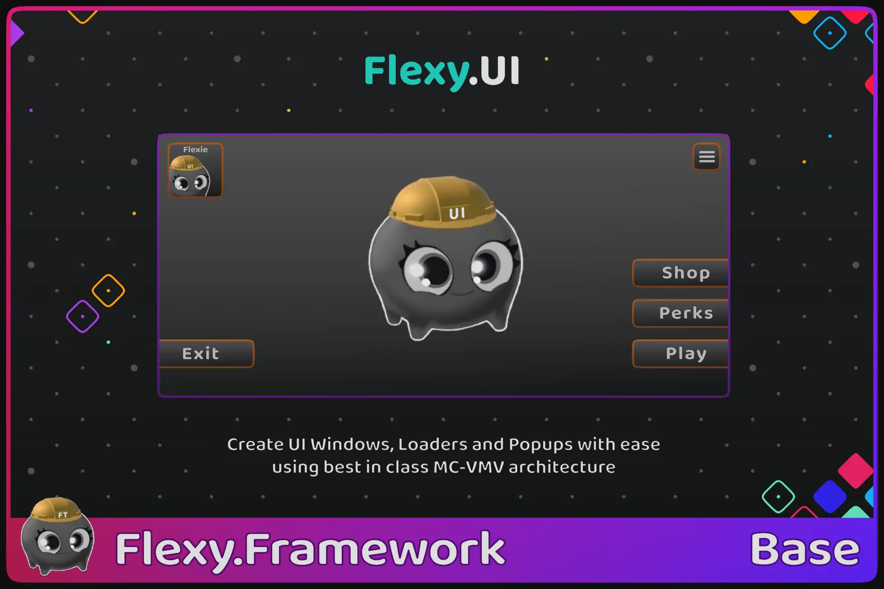



[Flexy.Tools](../../Readme.md) / [Framework](../Readme.md) / Flexy.UI

# Flexy.UI

Stop Hardcode UI control into code  
A production-proven game UI Solution for Unity  
Create UI Windows, Loaders and Popups with ease using best in class MC-VMV architecture 

[Github](https://github.com/FlexyTools/Flexy.UI)
<!-- | [Unity Forum](https://discussions.unity.com/t/a/1700923)
| [AssetStore](https://u3d.as/3LKx) -->  

Flexy.UI make your UI code super small and clean
It allows you to create UI windows, very fast and with ease 
Production-proven architecture, refined in real projects since 2012

[Start Guide](StartGuide.md) | [Binders](Binders.md) | [Extra](Extra.md) | [Misc](Misc.md) | [Showcase(Template project)](../../GameTemplates/Readme.md)

## Key Features

- Clear separation MonoBehaviour from UIView
- Clear intention expressed in code 
- Two way communication Binder to MonoBehavuiour and back
- Easy to bind collections of custom items 
- Easy to create reusable ui modules  
- Easy develop and test your UIWindow in isolation

With disabled Domain reload you will open your window with your TestCase almost instantly (on mid size project)  
And all GameStages with services will be already initialized so even your window Awake call will be in correct Context  
see [Flexy.Core](../Flexy.Core/Readme.md) and [Flexy.GameFlow](../Flexy.GameFlow/Readme.md) for more info on [GameStages](../Flexy.GameFlow/HowItWorks_UseCases.md) and [GameContexts](../Flexy.Core/GameContexts.md)

## Is this for you?

Flexy.UI is a good fit if:
- Your project grows beyond a simple prototype
- You have multiple UI Panels reused in different windows
- Your team has separate UI Artists from UI Developers 
- You care about clean architecture, testability, and long-term maintainability

**Flexy.UI is an architectural foundation and is intended to be adopted early in a project**

This asset is likely not a good fit if:
- You like to bake every UIControl into code

 

[Start Guide](StartGuide.md) | [Binders](Binders.md) | [Extra](Extra.md) | [Misc](Misc.md) | [Showcase(Template project)](../../GameTemplates/Readme.md)

## Technical details

### Compatibility

- Modern C# (C# 10)
- Designed to work with Domain Reload disabled
- Tested from Unity 2022.3 and up to Unity 6.3
- Depend on Flexy.GameFlow and Unity uGui
- Render pipeline agnostic
- Platform agnostic (shipped on Windows, macOS, Linux, Android, iOS)

 

[Flexy.Tools](../../Readme.md) / [Framework](../Readme.md) / Flexy.UI