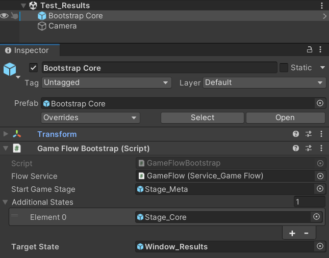
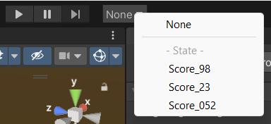

[Flexy.Tools](../../Readme.md) / [Framework](../Readme.md) / [Flexy.UI](Readme.md) / Start Guide

# Start Guide


Gameplay Results Window Sample 
- create your window derived from `UIWindow`
- define [Bindable] properties and methods for view (UIWindowPrefab) to bind to
- define [Callable] methods for view to call from events like button clicks
- open other windows through one line like `Graph.Service.Open<Window_PlayDetails>();` 
  - but better use `Game.UI.Details.Open();` see [Game Templates](../../GameTemplates/Readme.md) how!
- define `Opener` type as interface to open window in case your window needs to receive some parameters
  - read passed parameters from OpenParams property  
- define [StateTest] methods to test fast window open with different open parameters
- create Test_Scene with BootstrapPrefab setted up to your window as target state

```csharp
public class Window_Results : UIWindow
{
    [Bindable]      Single      Seconds             => (Single)OpenParams!;
    [Bindable]      String      FormattedSeconds    => Seconds >= 60 ? TimeSpan.FromSeconds( Seconds ).ToString( @"mm\:ss\.ff" ) : TimeSpan.FromSeconds( Seconds ).ToString( @"ss\.ff" );

    protected override  Boolean TryGoBack   ( )     => false;

    [Callable]          void    OpenDetails ( )     => Graph.Service.Open<Window_PlayDetails>();
    [Callable]          void    Continue    ( )     => Close();

    public new record struct Opener( OpenCtx Ctx ) : IOpener
    {
        public  FlowNode    Open    ( Single seconds ) => Ctx.Open( seconds );
    }
    
    [StateTest]     Object  Score_98    ( ) => 98.1f;
    [StateTest]     Object  Score_23    ( ) => 23.5f;
    [StateTest]     Object  Score_052   ( ) => 0.52f; 
}
```



- choose TestCase from test case drop down and press Play




With disabled Domain reload you will open your window with your TestCase almost instantly (on mid size project)    
And all GameStages with services will be already initialized so even your window Awake call will be in correct Context    
see [Flexy.Core](../Flexy.Core/Readme.md) and [Flexy.GameFlow](../Flexy.GameFlow/Readme.md) for more info on [GameStages](../Flexy.GameFlow/HowItWorks_UseCases.md) and [GameContexts](../Flexy.Core/GameContexts.md)   

<br>

[Flexy.Tools](../../Readme.md) / [Framework](../Readme.md) / [Flexy.UI](Readme.md) / Start Guide