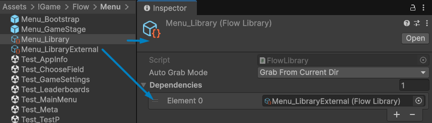
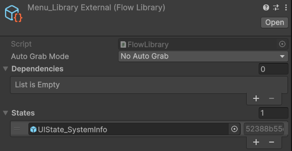
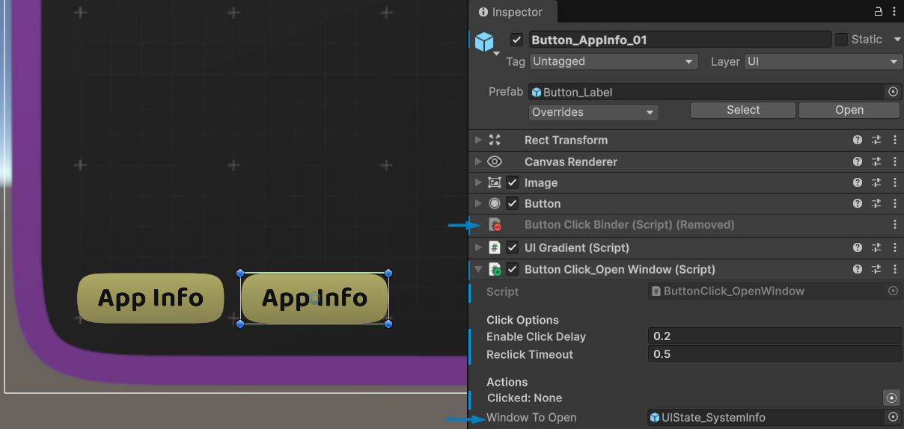



[Flexy.Tools](../../Readme.md) / [Framework](../Readme.md) / [How To](Readme.md) / Add State To Game

# How To: Add State To Game

## from Imported Package

### Simple fast way

- Go to your Flow library  
- If it works in any grab mode
  - Clone it
  - Make it no grab
  - Clear states  
  - Add new library as dependency to cloned one
- Add new **state/window** from package to library with no grab mode
- Duplicate some button in existing ui Window 
- Remove ButtonClickBinder if it was there
- Add `ButtonClickOpenWibdow` component and set `WindowToOpen` to new imported **state/window** 
  
  

- You are **DONE** enter play mode and open added **state/window** :)

 

### Have Fun

 

[Flexy.Tools](../../Readme.md) / [Framework](../Readme.md) / [How To](Readme.md) / Add State To Game