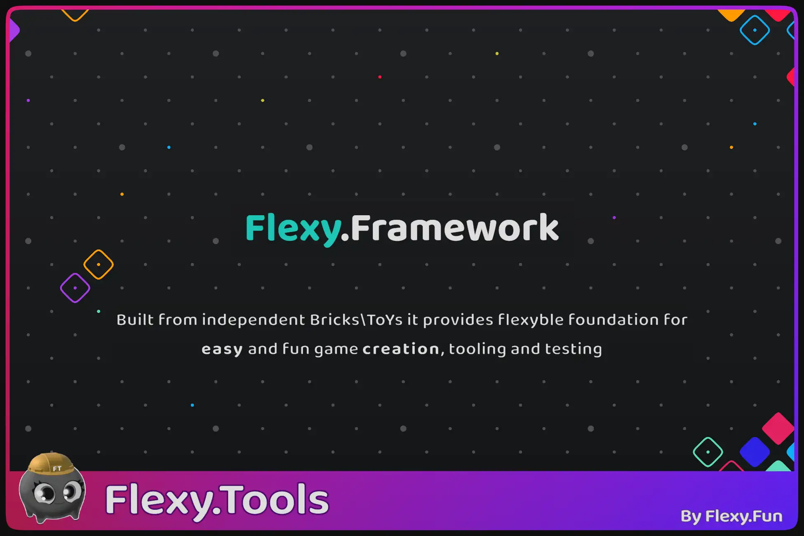

[Flexy.Tools](../Readme.md) / Framework

# Flexy Framework

**Modular framework built from independent Bricks and providing flexyble foundation for game creation, tooling, testing and gameplay systems**  

Here is documentation of all Flexy.Framework packages: Base, Meta, Core, QoL and others

All packages created as UPM packages so you can easily install them from PackageManager by address   
If you want to alter package, but it is readonly, embed it manually (by copying from Library/PackageCache to Packages) or use dedicated button in package manager 

[How to](HowTo/Readme.md)

## Base
| Package                                                       | Description                                                                                                                 | Links                                                                                                                                                   |  
|---------------------------------------------------------------|-----------------------------------------------------------------------------------------------------------------------------|---------------------------------------------------------------------------------------------------------------------------------------------------------|
| [Flexy.AssetRefs](Flexy.AssetRefs/Readme.md)   Free       | Weak Asset References solution                                                                                              | [Unity](https://discussions.unity.com/t/flexy/1605799)   [Store](https://u3d.as/3u78)   [Github](https://github.com/FlexyTools/Flexy.AssetRefs) |
| [Flexy.Core](Flexy.Core/Readme.md)   Free                 | Core package of **Flexy Framework** that every other package depends on                                                     | [Unity](https://discussions.unity.com/t/flexy/1701330)   [Github](https://github.com/FlexyTools/Flexy.Core)                                         |
| [Flexy.GameFlow](Flexy.GameFlow/Readme.md)   Lite / Pro   | Universal Hierarchical state machine that will manage your game states, transitions, in so simple way you never seen before | [Unity](https://discussions.unity.com/t/flexy/1711626)   [Github](https://github.com/FlexyTools/Flexy.GameFlow-Lite)                                |
| [Flexy.UI](Flexy.UI/Readme.md)   Lite / Pro               | Clean, scalable, and production-proven UI screen management for Unity                                                       | [Unity](https://discussions.unity.com/t/flexy/1711631)   [Github](https://github.com/FlexyTools/Flexy.UI-Lite)                                      |

## Utils
| Package                                                       | Description                                                                                      | Links                                                                                                                                                      |  
|---------------------------------------------------------------|--------------------------------------------------------------------------------------------------|------------------------------------------------------------------------------------------------------------------------------------------------------------|
| [Flexy.GameSettings](Flexy.GameSettings/Readme.md)   Free | Easily store game settings for settings window or any other needs with just one line per setting | [Unity](https://discussions.unity.com/t/flexy/1700923)   [Store](https://u3d.as/3LKx)   [Github](https://github.com/FlexyTools/Flexy.GameSettings) |
| [Flexy.Log](Flexy.Log/Readme.md)                              | Structured, Customizable and Allocation free drop in replacement logging for Unity               | [Unity](https://discussions.unity.com/t/flexy/1715000)   [Store](https://u3d.as/3R6j)                                                                                                                           |

## Menu
| Package               | Description              | Links |  
|-----------------------|--------------------------|-------|
| Under Construction... | Ready to go Meta screens |       |

## Play
| Package               | Description             | Links |  
|-----------------------|-------------------------|-------|
| Under Construction... | Ready to play Core ToYs |       |

 

[Flexy.Tools](../Readme.md) / Framework