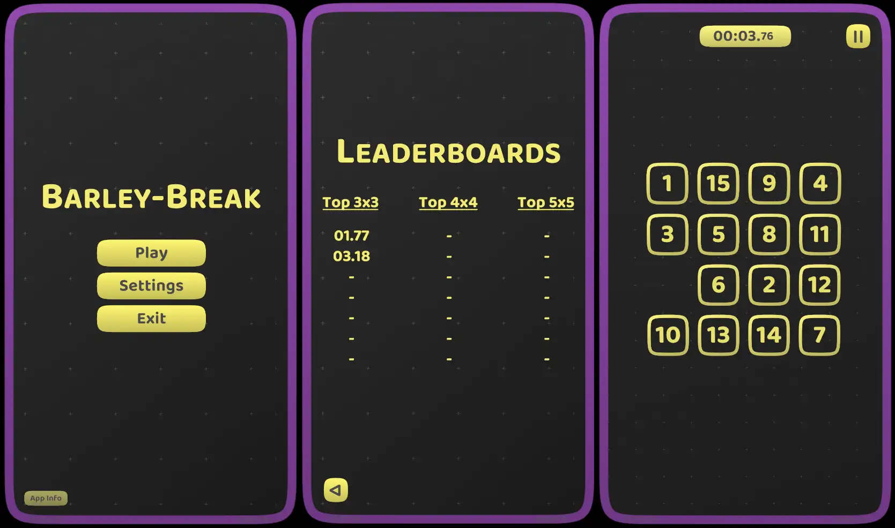

[Flexy.Tools](../../Readme.md) / [Game Templates](../Readme.md) / Barley-Breaks

# FlexyTT: Barley-Break

Simple Barley-Break Game with leaderboard and few field sizes  
It is create to showcase Flexy Framework and Flexy Project structure so Coregame here is less singnificant part  
[Github](https://github.com/FlexyTools/Flexy-TT.BarleyBreak)   

### Showcases:  
- Flexy.AssetRefs
- Flexy.GameSettings
- Flexy.Core (GameContext, EventAction, Binding)
- Flexy.GameFlow 
- Flexy.UI
- Flexy Project Structure

Also every FlexyTT show you how to structure project and code to keep it clean, modular and easy to maintain

### Structure:
- [Project structure and Assets](ProjectStructureAndAssets.md)
- [Code Structure and Flexy Project Template](CodeStructureAndFlexyProjectTemplate.md) 

[Flexy.Tools](../../Readme.md) / [Game Templates](../Readme.md) / Barley-Breaks