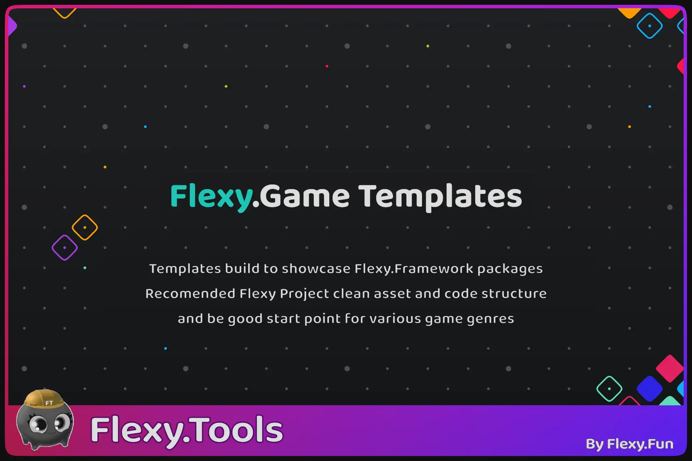
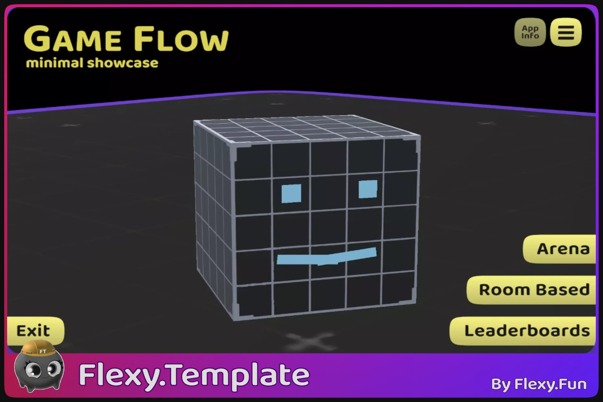

[Flexy.Tools](../Readme.md) / Flexy.GameTemplates

# Flexy Game Templates

Templates build to showcase Flexy.Framework packages  
Recomended Flexy Project clean asset and code structure  
and be good start point for various game genres

## Free

| Template                                                              | Description                                                                                                                                                                       | What it Showcases (Additively)                                                                                                                                |  
|-----------------------------------------------------------------------|:----------------------------------------------------------------------------------------------------------------------------------------------------------------------------------|:---------------------------------------------------------------------------------------------------------------------------------------------------------------------------------------------------------------------------------------|
|              | **[Barley-Break](Barley-Break/Readme.md)**  Simple Barley-Break Game with leaderboard and few field sizes   [Github](https://github.com/FlexyTools/Flexy-TT.BarleyBreak) | <ul><li>Flexy.AssetRefs <li>Flexy.GameSettings <li>Flexy.Core (GameContext, EventAction, Binding) <li>Flexy.GameFlow <li>Flexy.UI <li>Flexy Project Structure              |
|  | **[GameFlow Minimal Showcase](GameFlow-MinimalShowcase/Readme.md)**  Simple Cube Escape Game with leaderboard and flexy scene mangement sample   [Github](https://github.com/FlexyTools/FlexyTT.GameFlow-MinimalShowcase)                        | <ul><li>Menu Scene Management <li>ScrossScreneRef <li>MapPortals <li>Service_MapTransitions                     |
|                                                                       | **Side Runner**  Side scrolling infinite runner   under construction...                                                                                                  | More complex usage of contexts for coregame <ul> <li>Core <li>Map <li>GameMode                                                                                                                                              |

## Premium

under construction... 

 

[Flexy.Tools](../Readme.md) / Flexy.GameTemplates